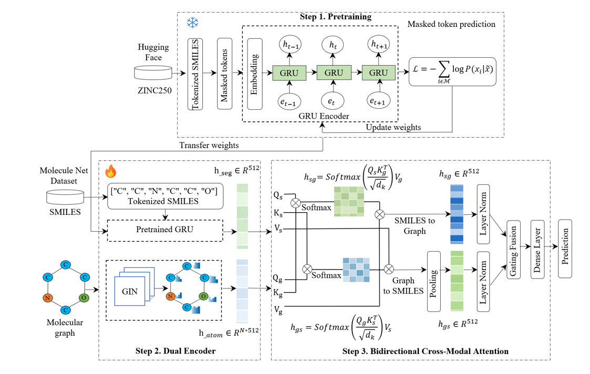

# MolBCAT: Self-Supervised GRU Pretraining with Bidirectional Cross-Modal Attention for Molecular Property Prediction

Official implementation of the paper:

> **MolBCAT: Self-supervised GRU pretraining with bidirectional cross-modal attention for molecular property prediction**
> Otgonzul Zorigt, Soualihou Ngnamsie Njimbouom, Candra Zonyfar, Jeong-Dong Kim

## Overview

MolBCAT is a lightweight multimodal molecular property prediction framework that integrates:
 - A self-supervised pretrained GRU encoder for SMILES sequences
 - A Graph Isomorphism Network (GIN) for molecular graphs
 - Bidirectional cross-modal attention for dynamic modality interaction
 - A gated fusion mechanism for adaptive representation learning
<p align="center">
  
</p>

<p align="center">
  <em>Figure: Overview of the MolBCAT framework.</em>
</p>

Despite using only 250K pretraining molecules and ~4.2M parameters, MolBCAT achieves competitive performance on multiple MoleculeNet benchmarks.

## Repository Structure

```
molbcat/
├── main.py                    # Primary CLI entry point
├── configs/
│   ├── classification.yaml    # HP grids, dataset paths, model config
│   ├── regression.yaml
│   └── pretrain.yaml
├── data/
│   └── README.md              # HuggingFace dataset links
├── src/
│   ├── models/
│   │   ├── gru.py             # GRU encoder and model
│   │   ├── gin.py             # GIN encoder and model
│   │   └── molbcat.py         # Full MolBCAT model
│   ├── dataset/
│   │   ├── smiles.py          # SMILES encoding and dataset
│   │   ├── graph.py           # Graph construction
│   │   └── split.py           # Scaffold split
│   ├── trainer.py             # Unified trainer (cls + reg)
│   ├── evaluation.py          # Metrics
│   └── utils.py               # Seed, checkpoint, helpers
├── scripts/
│   ├── pretrain.py            # Pretrain on ZINC250k
│   ├── train_cls.py           # Classification experiments
│   ├── train_reg.py           # Regression experiments
│   ├── train_dataeff.py       # Data efficiency experiments
│   ├── train_ablation.py      # Concatenation ablation
│   └── predict.py             # Inference
└── weights/                   # Download from Google Drive (see below)
```

## Installation

```bash
pip install torch==2.10.0
pip install torch-scatter -f https://data.pyg.org/whl/torch-2.10.0+cu128.html
pip install torch-sparse  -f https://data.pyg.org/whl/torch-2.10.0+cu128.html
pip install torch-geometric
pip install -r requirements.txt
```

> **Note:** The above assumes CUDA 12.8 (`cu128`). For CPU-only or other CUDA versions, replace `cu128` with `cpu`, `cu118`, etc.

## Pretrained Weights

Download weights from Google Drive and place them in the `weights/` folder:

```
weights/
├── vocab.json
├── pretrained_encoder_epoch10.pt
├── GRU_GIN/{dataset}/seed{1..10}/
│   ├── GRU_Random.pt
│   ├── GRU_Frozen.pt
│   ├── GRU_Finetune.pt
│   └── GIN.pt
├── MolBCAT/{dataset}/seed{1..10}/
│   └── MolBCAT.pt
└── Regression/{dataset}/seed{1..10}/
    ├── GRU_Random.pt  GRU_Frozen.pt  GRU_Finetune.pt  GIN.pt  MolBCAT_Reg.pt
```

Download pretrained weights from the link below:

[Download Weights (Google Drive)](https://drive.google.com/drive/u/0/folders/1JcMC1v_mQCMoa0IX91l1UF57_nnXz7Ob)

## Usage

### Step 1: Pretrain (optional — skip if using downloaded weights)

```bash
python main.py pretrain
```

### Step 2: Classification experiments

```bash
# All datasets
python main.py train_cls

# Single dataset
python main.py train_cls --dataset BBBP
```

### Step 3: Regression experiments

```bash
python main.py train_reg
python main.py train_reg --dataset ESOL
```

### Step 4: Data efficiency experiment

```bash
python main.py train_dataeff
```

### Step 5: Ablation study

```bash
python main.py train_ablation
```

### Predict on new molecules

```bash
# Single SMILES
python main.py predict --dataset BBBP --smiles "CC(=O)Oc1ccccc1C(=O)O"

# From CSV file
python main.py predict --dataset ESOL --input molecules.csv --output results.csv --model MolBCAT --seed 1
```

## Datasets

All datasets are loaded automatically from HuggingFace. See [`data/README.md`](data/README.md) for details.

| Dataset       | Task           | Metric  |
|---------------|----------------|---------|
| BBBP          | Classification | ROC-AUC |
| HIV           | Classification | ROC-AUC |
| ClinTox       | Classification | ROC-AUC |
| Tox21_NR_AR   | Classification | ROC-AUC |
| ESOL          | Regression     | RMSE    |
| Lipophilicity | Regression     | RMSE    |

## Reproducibility

- All experiments use scaffold split with 10 random seeds (seeds 1–10)
- Hyperparameters are selected via Phase 1 tuning (seed 42)
- Final metrics are mean ± std over 10 seeds
- Results are saved incrementally — interrupted runs can be resumed

## Data Splitting

We apply scaffold-based train/test separation using Murcko scaffolds to ensure that structurally distinct molecules are held out for evaluation. For validation, a stratified random split is applied on the training set to mitigate class imbalance and ensure stable evaluation during hyperparameter tuning.

## License

This project is licensed under the MIT License.
